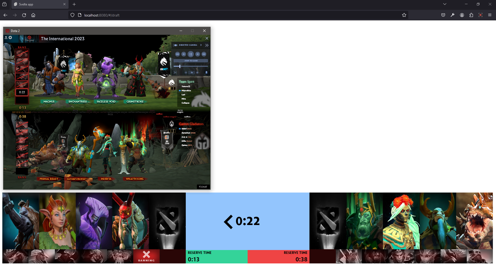
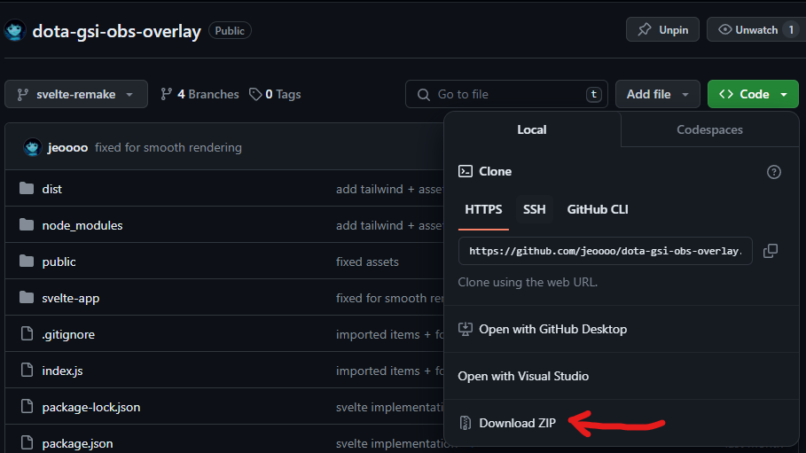

# DOTA 2 GSI OVERLAY 




OBS Browser source Streaming tools for DOTA 2 using game state integration

## Features

The DOTA 2 GSI Overlay is a streaming tool meticulously crafted to elevate DOTA 2 live broadcasts by seamlessly integrating real-time game information. 

Leveraging the power of the Game State Integration (GSI) feature within the DOTA 2 client, this overlay provides broadcasters with dynamic and up-to-the-moment data from the ongoing matches.

### Key Features
- **Real-time Updates:** The overlay taps into the DOTA 2 Game State Integration, offering broadcasters instantaneous updates on critical in-game events such as draft phase details, active teams, and the current game state.

- **Web GUI with Node.js:** At the heart of the project is a robust web-based Graphical User Interface (GUI) powered by Node.js. This backend component facilitates the communication with the DOTA 2 client and ensures the seamless parsing of game data.

- **Data Parsing with xzion/dota2gsi:** The project intelligently utilizes the xzion/dota2gsi library, enhancing the parsing of data from the DOTA 2 client. This library acts as a bridge, enabling effective communication between the game and the overlay.

- **Frontend with Svelte Framework:** The frontend of the GUI is meticulously crafted using the Svelte framework. This choice ensures a highly responsive and interactive user experience, enabling broadcasters to effortlessly navigate and utilize the overlay during live broadcasts.

- **Real-time Data Parsing with Websockets:** To achieve real-time data parsing and updates, the overlay employs Websockets. This technology ensures a continuous and efficient flow of information from the DOTA 2 client to the overlay, enabling broadcasters to provide a dynamic and engaging stream.

## Table of Contents

- [DOTA 2 GSI OVERLAY](#dota-2-gsi-overlay)
  - [Features](#features)
    - [Key Features](#key-features)
  - [Table of Contents](#table-of-contents)
  - [Installation](#installation)
  - [Resources](#resources)

## Installation

To configure the Dota client to report gamestate, you need to add a config file in `steamapps\common\dota 2 beta\game\dota\cfg\gamestate_integration\`. 

The file must use the name pattern called `gamestate_integration_*.cfg`, for example `gamestate_integration_dota2-gsi.cfg`.

The following example is included in this repository, you can copy it straight into your Dota directory to get started.

```
"dota2-gsi Configuration"
{
    "uri"               "http://localhost:3000/"
    "timeout"           "5.0"
    "buffer"            "0.1"
    "throttle"          "0.1"
    "heartbeat"         "30.0"
    "data"
    {
        "buildings"     "1"
        "provider"      "1"
        "map"           "1"
        "player"        "1"
        "hero"          "1"
        "abilities"     "1"
        "items"         "1"
        "draft"         "1"
        "wearables"     "1"
    }
    "auth"
    {
        "token"         "hello1234"
    }
}
```

Download this repository as a ZIP



or you may clone this repository using the following commands

```bash
git clone https://github.com/jeoooo/dota-gsi-obs-overlay.git
```

after setting up the config and the repository to your local machine, execute the following commands

```bash
npm install
node index.js
cd svelte-app
npm run dev

```

This will open up a local environment at `http://localhost:8080`

- This Web GUI currently has 2 features for now, namely
  - draft overlay
  - scoreboard (to be updated)

For more information, see the [CS:GO GameState Integration page](https://developer.valvesoftware.com/wiki/Counter-Strike:_Global_Offensive_Game_State_Integration)

## Resources

- [DOTA 2 Game State Integration NodeJS library by xzion](https://github.com/xzion/dota2-gsi)
- [qqquiu/dota2-webdraft: Dota 2 web-rendered picks and bans screen using dota2-gsi](https://github.com/qqquiu/dota2-webdraft)
- [Game State Integration fundamentals: Valve Game State Integraton for CSGO](https://developer.valvesoftware.com/wiki/Counter-Strike:_Global_Offensive_Game_State_Integration)
- [OBS Studio (for streaming the draft web GUI)](link_to_obs_studio)

